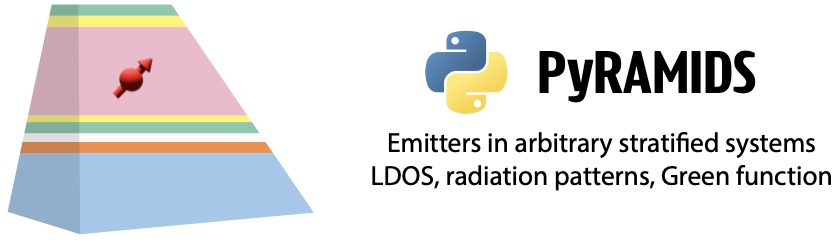

<h1>PyRAMIDS</h1>

<h2 align="center">A <b><i>Py<i></b>thon package for <b><i>R<i></b>adiation, <b><i>M<i></b>agnetoelectric <b><i>I<i><b>nteractions, and <b><i>D<i></b>ipoles in <b><i>S<i></b>tratified layers</h2>

<p align="center">
  
</p>

---
### Motivation and prospective use cases

PyRAMIDS is a simulation framework for nanophotonics and electromagnetic modeling in planar multilayer structures. It can serve both as a teaching tool and as a research platform.

It is designed for:

- Local density of states (LDOS) engineering  
- Dipolar emitter photophysics in layered media  
- Far-field radiation pattern analysis  
- Calibration and benchmarking: High NA objectives, Fourier microscope, Numerical Solvers  
- Multiple scattering of magnetoelectric dipoles  
- Device design workflows (LEDs, photovoltaics, cavities, multilayer metamaterials)  
- Inverse design and (co-)optimization of multilayer stacks and embedded dipolar scatterers  

---
## Scientific Scope

PyRAMIDS implements a Green-function based angular spectrum formulation for electromagnetic sources and dipole scatterers in arbitrary 1D multilayer stacks.

The framework addresses the following fundamental problem:
> Given an electric, magnetic, or magnetoelectric dipole embedded in a stratified system,  
> - What is the total emitted or scattered power?  
> - How is this power distributed across guided and radiative channels?  
> - What is the angular and polarimetric far-field signature?   

The implementation combines a stable S-matrix formalism with a rigorous 6x6 dyadic magnetoelectric Green-function framework, as detailed in the accompanying main manuscript and mathematical Supplementary text.

---

## Core Engines

---
### 1. S-Matrix solver – plane-wave multilayer response.

- Stable Redheffer star-product implementation
- Complex Fresnel coefficients for arbitrary multilayer stacks
- Reflectance, transmittance, absorptance
- Layer-resolved absorption and local field distributions
- Guided-mode and evanescent-wave physics at large $k_{\parallel}$

> Applications:
> Mirrors, LED stacks, photovoltaic layers, dielectric cavities.

---
### 2. Radiation pattern engine – angular and polarimetric response

- Angle-resolved far-field emission  
- s-p polarization basis and Cartesian basis    
- Radiative LDOS extraction via angular integration
- Back-focal-plane (Fourier plane) imaging simulations  
- Stokes polarimetry ($S_0$-$S_3$)

> Applications:
> Emitter calibration, high-NA objective benchmarking, COMSOL/FDTD validation, LED outcoupling analysis.

**Note:**
- The superstrate and substrate must have real (non-absorbing) refractive indices to have energy conservation.

---
### 3. Local Density of States (LDOS) Framework.
LDOS is computed from the imaginary part of the dyadic Green function (ImG formalism; Amos & Barnes):
$\rho \propto \mathbf{e}_d^{T} \mathrm{Im}[G(\mathbf{r},\mathbf{r})] \mathbf{e}_d$

- Electric and Magnetic LDOS  
- Magnetoelectric (chiral / bianisotropic) LDOS  (for mixed p-m dipoles)
- Total LDOS via complex-contour integration over $k_{\parallel}$  
- $k_{\parallel}$-resolved modal analysis  
- LDOS for arbitrary dipole orientations via combination of the canonical components

### 4. Dyadic Green Function Engine

- Full 6x6 magnetoelectric Green tensor
- Angular spectrum representation
- Returns the **full Green tensor** as `G = G_scattered + G_free` (`Greensafe`)
- Slab-centric internal coordinate formalism
- Free-space dyadic contribution is evaluated explicitly (`Core_Greenslab.FreeDyadG`)
- Explicit electric/magnetic cross-coupling blocks

> Applications:
> Drexhage experiments, Purcell engineering, extraction of emitter quantum efficiency from LDOS fits, LEDs and photovoltaics.

**Note:**
- If a query point falls in a layer with refractive index not real-positive, the wrapper returns 0 and issues a warning (to avoid unphysical outputs).
- Source and detector must lie in the same layer for this Green implementation (current scope).

---
### 5. Multiple Scattering of Dipolar Particles

- Coupled-dipole formalism in layered media  
- Excitation by plane-wave illumination or local dipole sources
- Dynamic polarizability dressing including radiation damping
- Extinction via work $\mathrm{Re}[\mathbf{j}^* \cdot \mathbf{E}]$; scattering cross sections via angular far-field integration  
- Full electric–electric, magnetic–magnetic, and cross magnetoelectric polarizability blocks (supporting Kerker, Huygens, and split-ring–type dipolar scatterers)

> Applications:
> Metasurface design, layered nanoantenna arrays, and inverse (co-)optimization of multilayer stacks with embedded scatterers.
> Orders of magnitude faster than full-wave FEM/FDTD for large device finite-footprints.

---
## Folder structure

```
Library/
    Core/          # S-matrix, Green function, LDOS integrands, radiation kernels
    Util/          # Argument checking, coordinate wrappers, visualization, DE optimizer
    Use/           # High-level user interfaces

Benchmarks/
    Literature/    # Reproduction of seminal results from published literature
    Internal_Consistency/  # Cross-validation tests

Example/           # Reproducible figures and workflows
UserSandbox/       # Custom simulation workspace for users
Manual.pdf         # PDF documentation
```

PyRAMIDS follows a layered folder implementation architecture consisting of **Core**, **Util**, and **Use** modules.

- The **Core** module contains low-level mathematical implementations (S-matrix, Green functions, LDOS integrands, radiation kernels) and provides direct access for advanced users who wish to inspect, modify, or extend the formalism.
- The **Util** module contains argument checking, coordinate rewrapping, visualization, and optimization utilities used by high-level interfaces.
- The **Use** module provides high-level, user-facing interfaces for standard simulation workflows, including coordinate handling, validation, and convenience wrappers.
- The **Core** module uses a slab-centric representation; in the **Use** layer, users interact with global stack coordinates.

---
- In this user convention, $z = 0$ corresponds to the first interface between the substrate and the stack, with positive $z$ pointing toward the superstrate.
- Polar angle is measured from the surface normal: \($\theta=0^\circ$\) is normal to the plane, \($\theta=90^\circ$\) is in-plane or grazing. In code, upper hemisphere uses \($\cos\theta>0$\), lower hemisphere uses \($\cos\theta\le 0$\).

---
## Installation and Dependencies

Get the code:

```bash
git clone https://github.com/AMOLFResonantNanophotonics/PyRAMIDS.git
cd PyRAMIDS
```

Alternative workflows:
- VS Code: use `Git: Clone`, then open the cloned `PyRAMIDS` folder.
- GitHub ZIP: `Code -> Download ZIP`, unzip, then open `PyRAMIDS` in VS Code or Spyder.

PyRAMIDS is implemented in Python.

Validated development environment:

- Python 3.12.7  
- NumPy 1.26.4  
- SciPy 1.15.1  
- Numba 0.60.0  
- Matplotlib 3.9.2

Install dependencies:

```bash
pip install numpy==1.26.4 scipy==1.15.1 numba==0.60.0 matplotlib==3.9.2
```

Other versions are typically compatible, but only the versions above have been formally validated.

---
## Benchmarks and Validation
The **Literature** subdirectory reproduces seminal results from various published nanophotonics literatures.

The **Internal\_Consistency** subdirectory cross-checks independent formulations of the same physical quantities:

- LDOS from ImG vs LDOS from integrated radiation patterns (electric, magnetic, and magnetoelectric dipoles, including off-axis and phase-shifted cases)
- LDOS-like quantities compared across radiation-pattern integration, ImG-LDOS, and scattered Green-tensor routes
- Dyadic Green tensor checks against analytical free-space limits, reflected-interface terms, and mirrored-geometry symmetry/sign behavior
- Optical-theorem consistency in multiple scattering for plane-wave-driven dipole arrays in layered structures
- Rotational consistency of pseudochiral dipole definitions via Stokes $S_3$ radiation maps in upper/lower hemispheres

> These checks ensure physical consistency and numerical robustness across the framework.
---

## Authors

**Debapriya Pal, A. Femius Koenderink**  

Department of Physics of Information in Matter,
Center for Nanophotonics,  
NWO-I Institute AMOLF,  
Amsterdam 1098 XG, The Netherlands  

Contact: f.koenderink@amolf.nl  

---
## Citation

If you use PyRAMIDS in your research or for any other purpose, please cite and acknowlege:

Pal, D. & Koenderink, A. F.  
*PyRAMIDS — A Python package for Radiation, Magnetoelectric Interactions, and Dipoles in Stratified Layers (2026)*

---
## License
